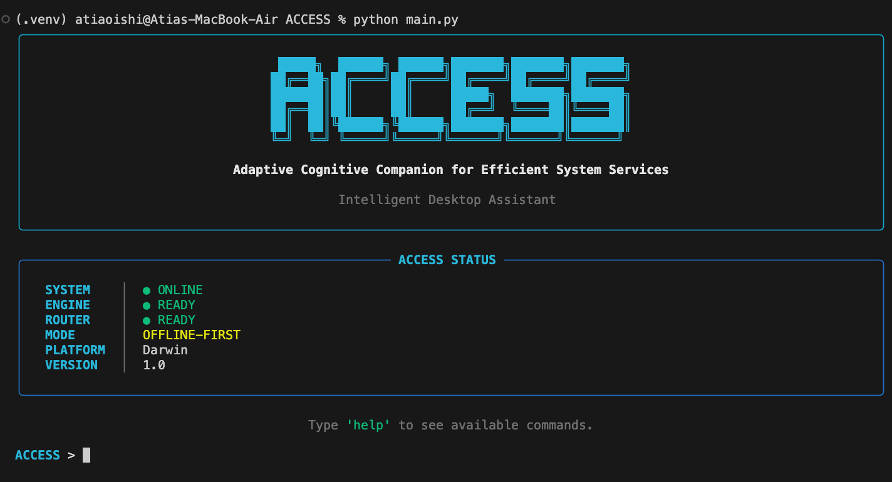

<div align="center">

# ACCESS

**Adaptive Cognitive Companion for Efficient System Services**

*Intelligent Desktop Assistant*


 windows





</div>

---

ACCESS is a modular, offline-first desktop assistant for macOS that interprets natural language commands and executes them as real system actions — app control, system operations, and more — through a rule-based router with an AI decision layer in progress.

## ✨ Features

**Currently Working**
- 🖥️ Application control (e.g. `open calculator`)
- ⚙️ Rule-based command router
- 🧩 Modular architecture (core, tools, memory, plugins, ui, voice)
- 📡 Offline-first operation

**Planned**
- 🧠 AI-powered interpretation & decision layer (in active development)
- 🗂️ File operations
- 📸 Screenshot capture
- 🧾 Persistent memory
- 🔗 Multi-step task planning
- ✅ Confirmation prompts for destructive actions

## 🧠 Architecture

```
User
  ↓
Interface (Terminal UI)
  ↓
Engine
  ↓
Router
  ↓
Tools / System Control
```

*AI/Decision Layer is currently being integrated between the Engine and Router.*

## 🛠️ Tech Stack

Python • Rich (terminal UI) • Modular plugin system

## 📦 Installation

```bash
git clone https://github.com/AtiaAbk/ACCESS.git
cd ACCESS
python -m venv .venv
source .venv/bin/activate
pip install -r requirements.txt
python main.py
```

## 💻 Usage

```
ACCESS > open calculator
ACCESS: Opening Calculator.
```
<div align="center">


## 🗺️ Roadmap

- [ ] Integrate AI decision layer (Phase 5)
- [ ] Add file operation & screenshot tools
- [ ] Persistent memory system
- [ ] Multi-step task planning
- [ ] Voice interface
</div>

## 👥 Contributors

**Atia Oishi** ([@AtiaAbk](https://github.com/AtiaAbk)) — atia.abk@gmail.com

## 📄 License

*Add your project's license here.*

---

<div align="center">

Built with 🖤 on macOS

</div>
